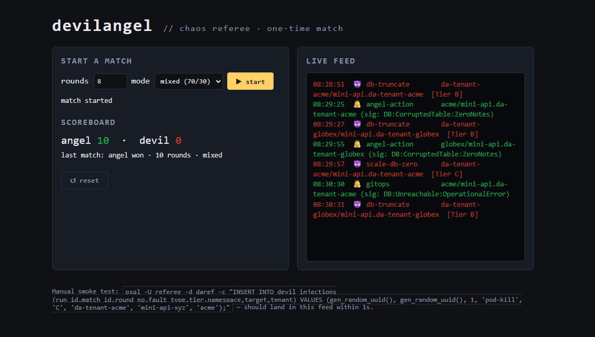
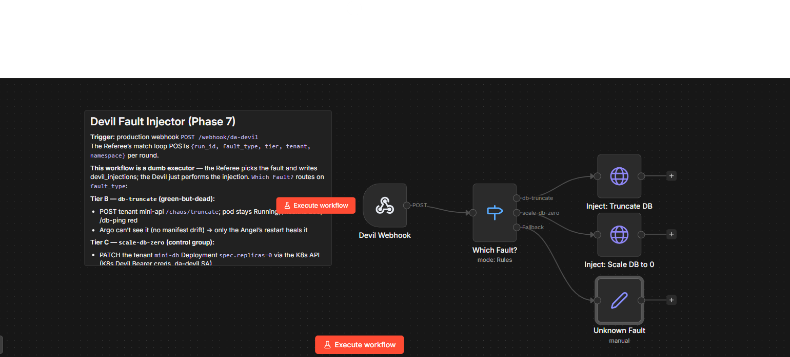

# angel-devil-chaos

A small chaos-engineering arena that answers one question with data:

> **Of the things that break in a GitOps cluster, which ones does Argo CD heal for free — and which ones still need an agent?**

A **Devil** injects faults. An **Angel** tries to heal them. A **Referee** runs the match, scores every round, and writes a scoreboard. The Devil and Angel are [n8n](https://n8n.io) workflows; the Referee is a small FastAPI app. Everything runs on Kubernetes and is reconciled by Argo CD.

The interesting part isn't the demo — it's what the scoreboard reveals about the **boundary of GitOps self-healing**.



In a healthy run the live feed reads its own conclusion out loud: `db-truncate [Tier B] → angel-action` (GitOps couldn't see it) and `scale-db-zero [Tier C] → gitops` (Argo reverted it, the Angel stood down).

---

## The core idea: two tiers of fault

Argo CD with `selfHeal: true` continuously reverts the cluster to match Git. That makes it a great healer for one *class* of fault and completely blind to another.

| Tier | Example fault | What Argo CD sees | Who actually heals it |
|------|---------------|-------------------|-----------------------|
| **B — green-but-dead** | App truncates its own database table. Pod stays `Running`, `/healthz` returns 200, but the data is gone. | **Nothing.** No manifest drift — the Deployment is unchanged. Argo is blind. | Only a targeted remediation (here: restart the pod, which re-seeds on startup). This is the Angel's job. |
| **C — manifest drift** | The DB `Deployment` is scaled to `replicas: 0`. The database goes unreachable. | **Drift.** Live state ≠ Git. Argo reverts `replicas` back to 1. | **GitOps, for free.** selfHeal fixes it in seconds; the Angel should stand down. |

Tier B is the *control group's opposite*: it's the stuff a naive "just run Argo" setup silently fails to recover. Tier C is the control group: it proves the harness measures GitOps correctly, because the Angel must **not** take credit for it.

The headline metric is **share-needing-Angel**: the fraction of rounds where GitOps alone was insufficient. In a healthy run of the bundled `mixed` mode (70% Tier B / 30% Tier C), it lands at **70%** — exactly the Tier B share.

---

## How a round works

```
Referee picks a fault ──> writes devil_injections row ──> POSTs the Devil webhook
                                                              │
                                          Devil injects the fault (Tier B or C)
                                                              │
   Angel polls every 15s, detects the broken check, diagnoses by symptom,
   heals (or stands down for GitOps), and logs an angel_actions row
                                                              │
   Referee polls angel_actions; first qualifying heal wins the round.
   Timeout ⇒ Devil point (a Tier B timeout is a "big win" — GitOps blind spot
   that nothing recovered).
```

Correlation between Devil and Angel is purely by **tenant + time window** — the Angel never reads the Devil's injection record. The two agents are fully decoupled; the Referee is the only thing that knows the ground truth.

## The Angel diagnoses by symptom (and why that matters)

The Angel never reads which fault was injected. It infers the tier from the **symptom** of the failing health check:

- `db-ping` returns **"0 notes"** → `DB:CorruptedTable:ZeroNotes` → **Tier B** → restart the app, log `angel-action`.
- `db-ping` returns a **connection error** → `DB:Unreachable:*` → **Tier C** → wait for Argo's selfHeal, verify recovery, log `gitops`.

> ### A bug worth keeping in the README
> The first version of the Angel didn't route on symptom. It polled Argo CD's
> sync status to decide "is Argo already healing this?" — and it lost the race.
> Argo reverts a scaled-to-zero Deployment in **~5 seconds**, but the Angel polls
> every **15 seconds**, so by the time it looked, Argo was already `Synced` again.
> The Angel then ran its Tier B remediation, saw the app was green (because Argo
> had quietly fixed it), and **credited itself** for GitOps's work — inflating
> share-needing-Angel from 70% to ~90%.
>
> The fix: stop trying to catch Argo in the act. Route on the *symptom* instead.
> An unreachable DB is manifest-level drift Argo owns; a corrupted-but-up DB is
> Argo's blind spot. That distinction is something a real SRE makes too, and it
> removes the race entirely.


The `Infra Fault?` switch is the whole fix: the top branch is the Angel standing down for GitOps, the bottom branch is the Angel doing what GitOps can't — decided from the symptom, not from anything Argo reports.

---

## Architecture

```
                         ┌──────────────────────────┐
                         │  Referee (FastAPI + PG)   │  da-referee ns
                         │  picks faults, scores,    │  /score, /start-match,
                         │  serves the scoreboard    │  /events (SSE)
                         └─────────┬───────────┬─────┘
            POST webhook           │           │  poll angel_actions
                 ┌─────────────────┘           └───────────────┐
                 ▼                                              ▼
        ┌────────────────┐                            ┌──────────────────┐
        │  Devil (n8n)   │  injects:                  │   Angel (n8n)    │
        │  - truncate DB │  Tier B  ─ app self-corrupt│  - detect broken │
        │  - scale DB →0 │  Tier C  ─ k8s API patch   │  - diagnose tier │
        └───────┬────────┘                            │  - heal / stand  │
                ▼                                      │    down for Argo │
   ┌─────────────────────────┐                        └────────┬─────────┘
   │  Playfield tenants       │  da-tenant-acme / -globex       │
   │  mini-api (FastAPI) +    │ <───────────────────────────────┘
   │  mini-db (Postgres)      │   restart pod  /  (Argo reverts replicas)
   └─────────────────────────┘
                ▲
                │  selfHeal: true
        ┌───────┴────────┐
        │    Argo CD     │  reconciles everything from Git
        └────────────────┘
```

- **Playfield tenants** (`da-tenant-*`): each is a `mini-api` (FastAPI) + `mini-db` (Postgres) with three health checks (`/healthz`, `/db-ping`, `/secret-check`). They exist to be broken and watched. Per-tenant `ResourceQuota`, `LimitRange`, and a namespace-scoped secret store keep them isolated.
- **Referee** (`da-referee`): orchestrates matches, owns the scoreboard Postgres, streams live events over SSE.
- **n8n RBAC**: the Devil and Angel run as n8n workflows authenticating to the Kubernetes API with **separate, namespace-scoped ServiceAccounts** (`da-devil`, `da-angel`). The Devil can delete pods and patch Deployments *only in the tenant namespaces*; the Angel gets a deliberately narrow healer role. Blast radius is bounded by RBAC, not by hope.



The Devil is a dumb executor — the Referee decides *what* breaks and the switch only routes `fault_type` to the right injector. Tier B calls the tenant's own `/chaos/truncate`; Tier C patches the `mini-db` Deployment to zero replicas via the Kubernetes API.

---

## What this repo assumes

This is a **reference architecture**, not a turnkey chart. It is the real, working
setup extracted from a single-node k3s homelab and sanitized. It assumes:

- **Argo CD** with `selfHeal: true` watching the tenant manifests (the whole premise).
- **n8n** running in a namespace called `n8n`, into which the Devil/Angel ServiceAccounts are deployed (via `extraDestinationNamespaces` on your Argo `AppProject`). Import the two workflows from [`chart/workflows/`](chart/workflows/) and attach credentials (see below).
- **Traefik** as ingress with a `websecure` entrypoint (adjust `entryPoints` / hosts to your environment).
- **External Secrets Operator + Vault** for the per-tenant API keys and the Referee's secrets. The `vault.vault.svc` server address and the Kubernetes-auth roles are placeholders — wire them to your own Vault, or swap the `SecretStore`/`ExternalSecret` resources for your secret backend.
- Container images built locally and imported into the node (see each `app/*/Dockerfile`); there is no registry push in the reference. Point `images.*` at your registry if you prefer.

None of these are load-bearing for the *idea* — they're the substrate it was built on. The transferable parts are the two-tier fault model, the symptom-routing Angel, and the Referee's scoring.

---

## Layout

```
chart/
  Chart.yaml                     Helm chart (phase-toggled: playfield / referee / n8nRbac)
  values.yaml                    defaults + per-tenant config
  values-da.yml                  example overrides (enables all phases)
  templates/
    playfield-tenants.yaml       mini-api + mini-db + quota + secret store, per tenant
    referee.yaml                 Referee app, Postgres, secrets, IngressRoute
    n8n-sa-angel.yaml            Angel ServiceAccount + narrow healer RBAC
    n8n-sa-devil.yaml            Devil ServiceAccount + tenant-scoped destructive RBAC
  app/
    mini-api/                    playfield app (FastAPI) — the thing that breaks
    referee/                     match orchestrator + scoreboard (FastAPI + Jinja)
  workflows/
    devilangel-devil.json        Devil n8n workflow (fault injector)
    devilangel-angel.json        Angel n8n workflow (symptom-routing healer)
```

## Quickstart (sketch)

```bash
# 1. Build the two app images and make them available to your cluster
( cd chart/app/mini-api && docker build -t mini-api:0.2.0 . )
( cd chart/app/referee && docker build -t da-referee:0.4.0 . )

# 2. Render / install (adjust hosts, vault server, namespaces first)
helm template da chart -f chart/values.yaml -f chart/values-da.yml | kubectl apply -f -
#    …or point an Argo CD Application at chart/ with values-da.yml

# 3. In n8n: import both chart/workflows/*.json, attach a K8s bearer credential
#    per agent (the da-devil / da-angel ServiceAccount tokens), activate both.

# 4. Run a match
curl -XPOST http://referee.example.com/start-match \
  -H content-type:application/json -d '{"rounds":10,"mode":"mixed"}'

# 5. Watch the scoreboard
curl http://referee.example.com/score | jq
```

Match modes: `pure-b` (all Tier B), `pure-c` (all Tier C control), `mixed` (~70/30).

---

## License

MIT © Janos Gyorgy
